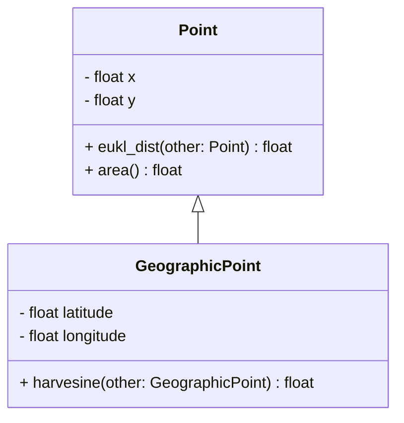

```mermaid
classDiagram
    class Point {
        - float x
        - float y
        + eukl_dist(other: Point) float
        + area() float
    }

    class GeographicPoint {
        - float latitude
        - float longitude
        + harvesine(other: GeographicPoint) float
    }

    Point <|-- GeographicPoint
```
